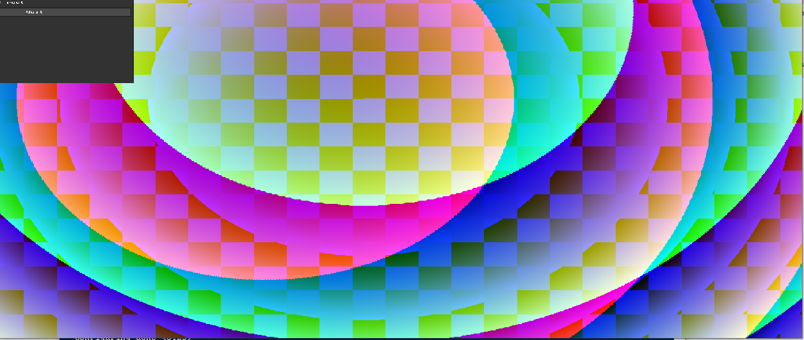
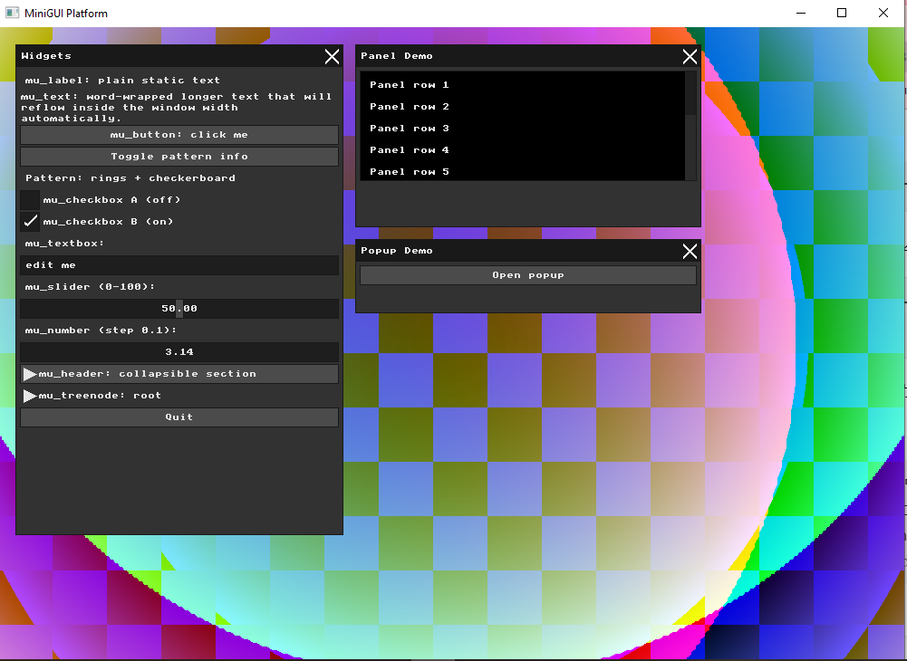
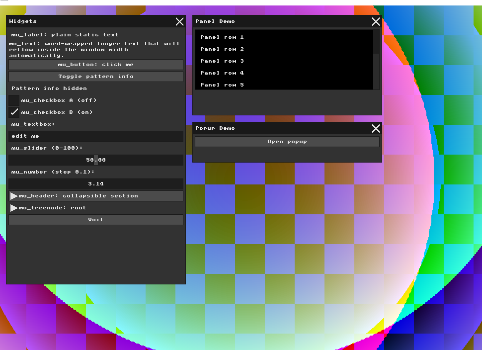
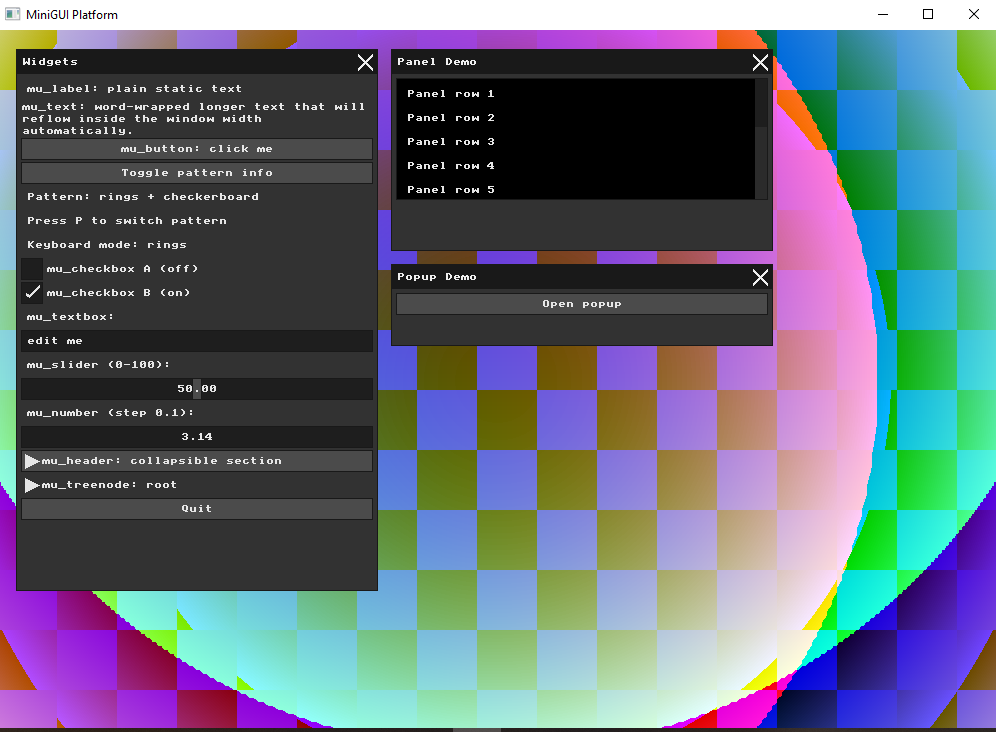
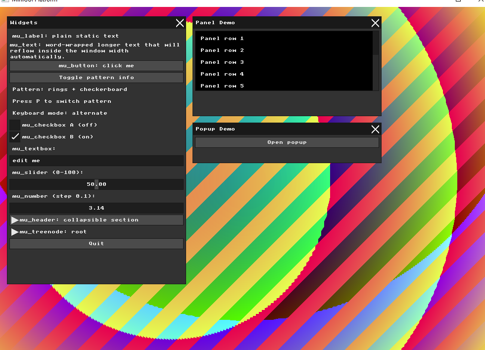
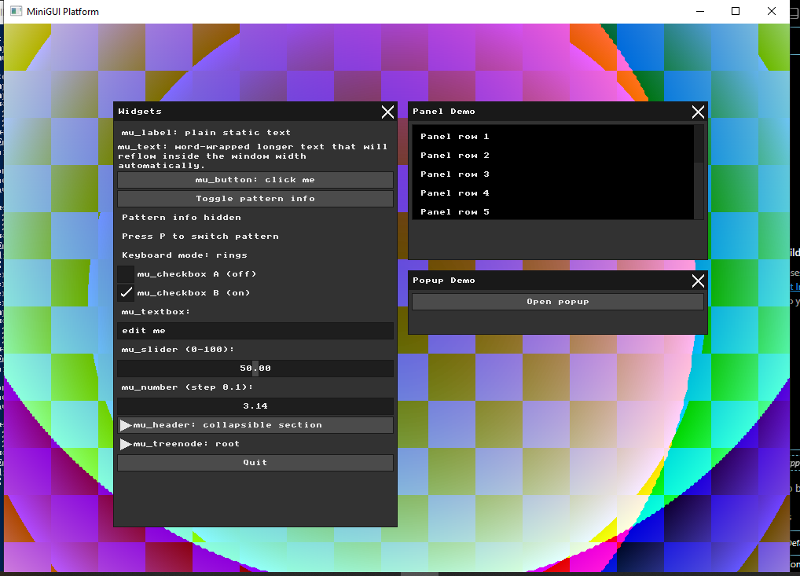
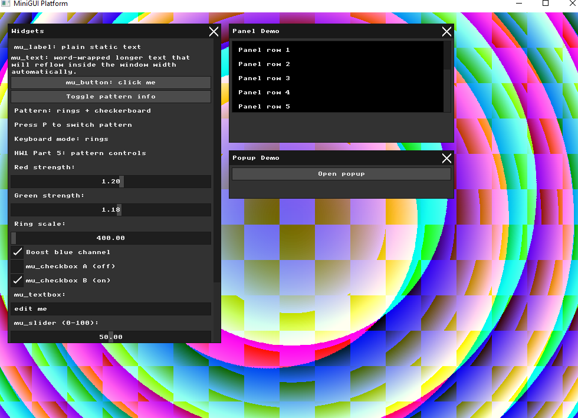
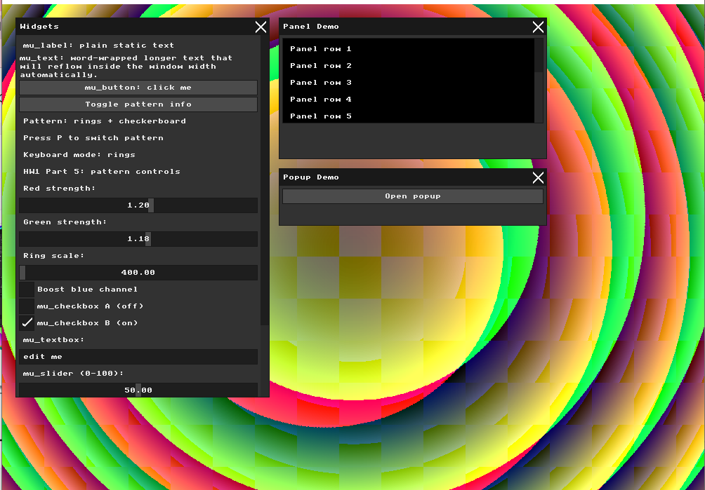
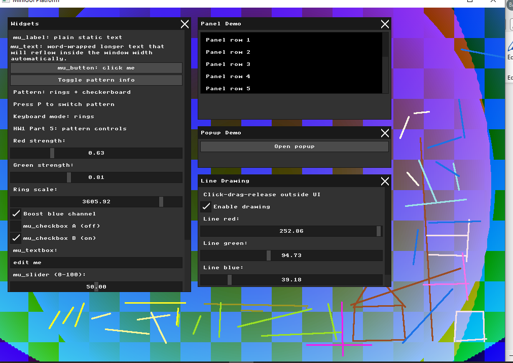

# HW1 Report - Computer Graphics

**Student Name:** Bayan Hasarme  
**Student ID:** 209432061  

---

## Part 1 - Framebuffer Pattern

In this part, I changed the original simple gradient background into a two-dimensional procedural framebuffer pattern.

The new pattern is computed directly for every pixel in `g_buffer`. I used the pixel coordinates `x` and `y`, and also calculated the distance from the center of the screen using:

```cpp
cx * cx + cy * cy
```

This creates circular/ring-like shapes. I also added a checkerboard expression based on both `x` and `y`, so the result is not a simple horizontal or vertical gradient.

Later, I reduced the window size from `1600x1200` to `1000x700` so the UI would fit better on my screen, but the framebuffer pattern idea remained the same.



---

## Part 2 - Immediate Mode UI Widget

In this part, I added a custom MicroUI widget inside the existing `Widgets` window.

I added a button called `Toggle pattern info`.

The button changes the value of a state variable called `show_pattern_info`. When the value is enabled, the UI shows information about the current pattern. When the value is disabled, the UI shows that the pattern information is hidden.

This demonstrates the Immediate Mode UI idea: the UI is rebuilt every frame, but the application state is stored separately.

### Pattern information visible



### Pattern information hidden



---

## Part 3 - Keyboard Pattern Toggle

In this part, I added keyboard input.

Pressing the `P` key changes the value of the global variable `g_pattern_mode`.

When `g_pattern_mode == 0`, the program displays the rings and checkerboard pattern.  
When `g_pattern_mode == 1`, the program displays an alternate diagonal pattern.

The UI also shows the current keyboard mode, so it is clear which mode is active.

### Rings mode



### Alternate mode



---

## Part 4 - Renderer Offset Experiment

In this part, I modified only the rendering stage inside `ui_renderer.cpp`.

I added an offset to the rendered UI commands:

```cpp
ui_offset_x = 120;
ui_offset_y = 80;
```

This moved the visual UI to the right and downward.

The important observation is that only the drawing was shifted. MicroUI still calculated the layout and mouse hitboxes in the original positions. Therefore, the UI appeared in a new visual location, but the clickable area stayed in the old location.

After documenting this experiment, I restored the renderer back to normal so the later parts would be usable.



---

## Part 5 - UI Controlled Pattern Parameters

In this part, I connected UI controls to the framebuffer rendering logic.

I added sliders and a checkbox that directly affect the background:

- `Red strength` controls the red channel intensity.
- `Green strength` controls the green channel intensity.
- `Ring scale` changes the spacing and size of the ring pattern.
- `Boost blue channel` changes the strength of the blue component.

Because the framebuffer is recomputed every frame, moving the sliders immediately changes the rendered pattern.

### Pattern controls example 1



### Pattern controls example 2



---

## Part 6 - Interactive Line Drawing

In this part, I implemented an interactive line drawing tool.

The interaction works as follows:

1. Click on the framebuffer outside the UI.
2. Drag the mouse.
3. Release the mouse.
4. A straight line is saved and redrawn every frame.

The line is drawn using Bresenham's line algorithm. I also added sliders to control the line color using red, green, and blue values.

The `Clear lines` button removes the saved lines.

This part draws straight lines between the click position and the release position. It is not a freehand brush tool, because each stroke is one line segment.



---

## Summary

In HW1, I practiced direct framebuffer manipulation, Immediate Mode UI widgets, keyboard input, renderer-level UI drawing, UI-controlled rendering parameters, and interactive line drawing using Bresenham's algorithm.

The assignment was completed step by step with separate Git commits for each part.
