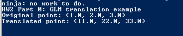
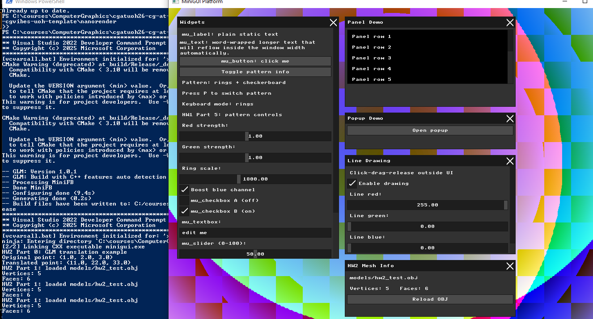
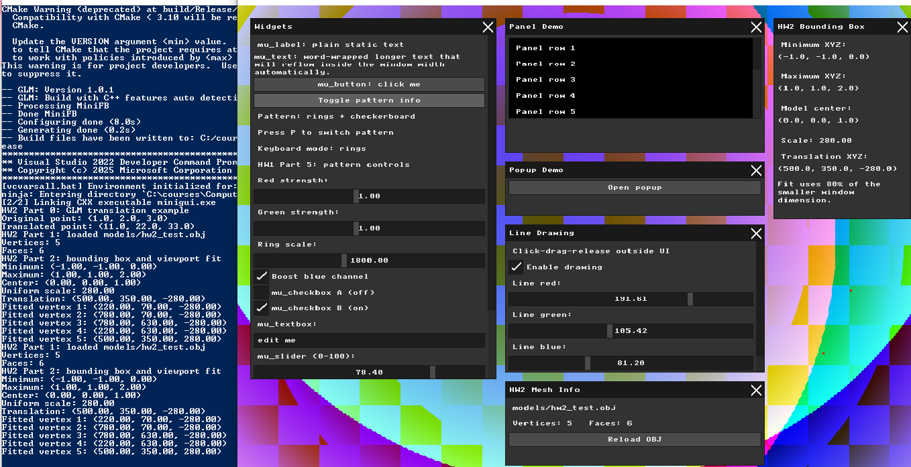
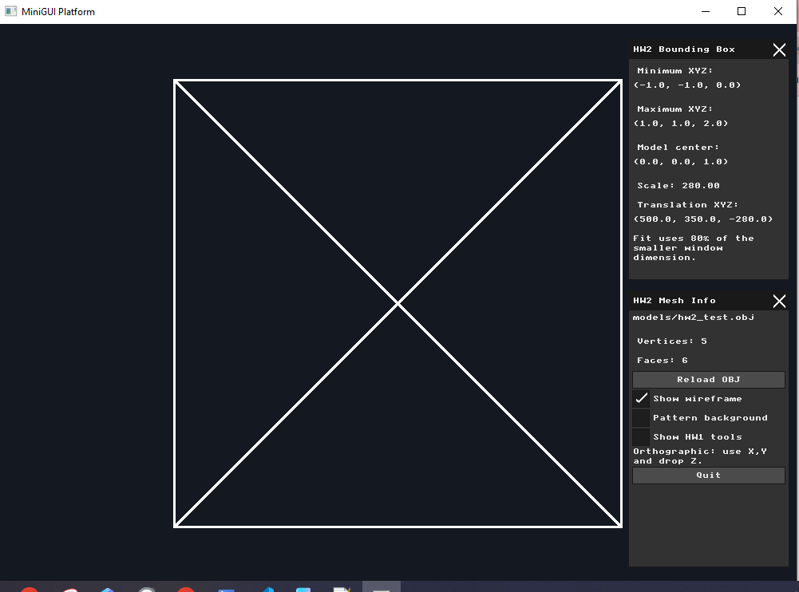
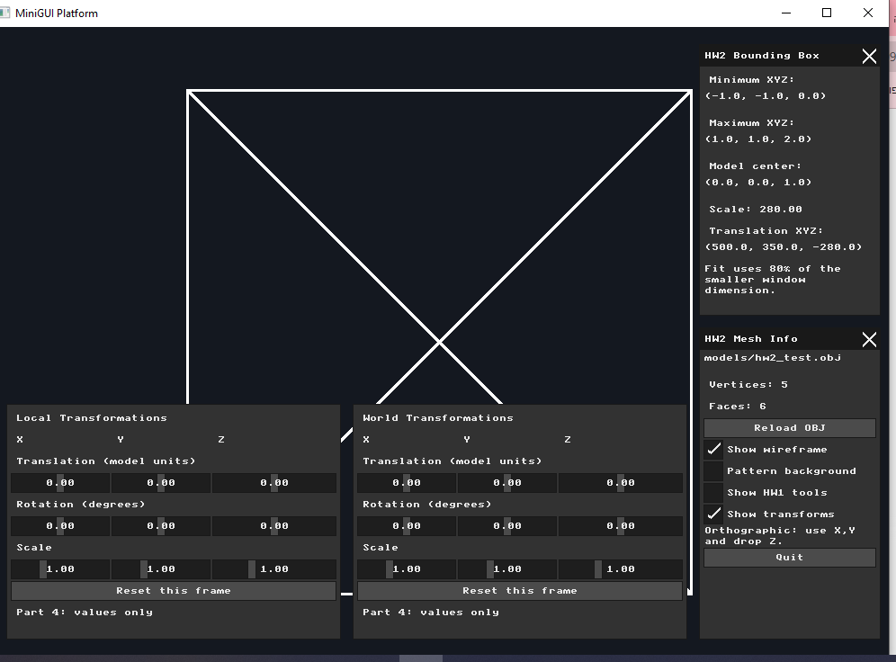
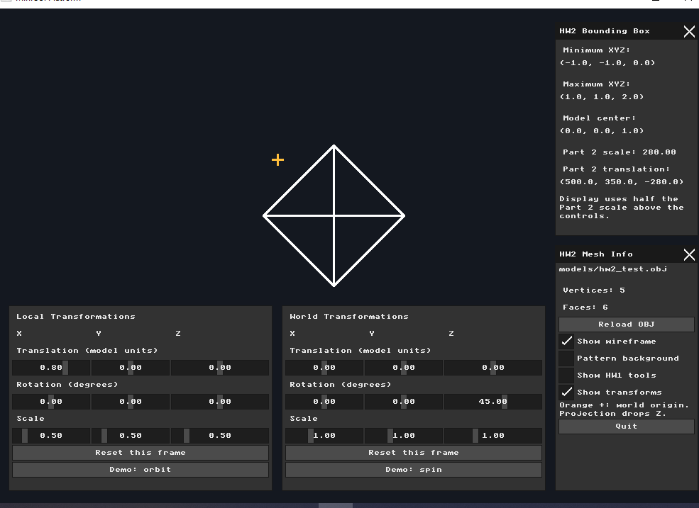
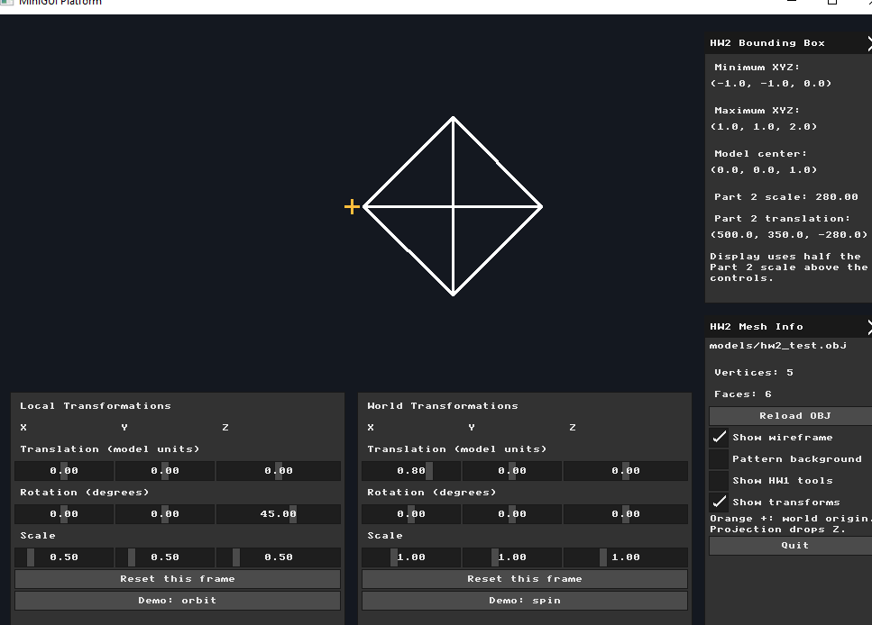
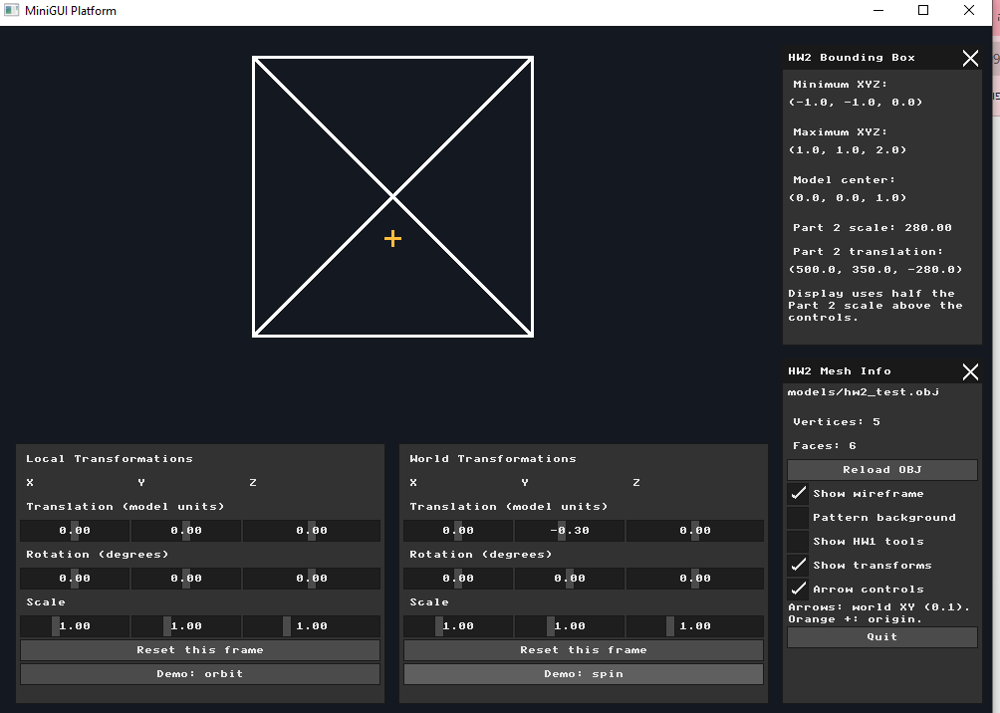

# Homework 2 — 3D Meshes and Transformations

**Name:** Bayan Hasarme  
**Student ID:** 209432061  
**Submission:** Individual

## Overview

In this assignment, I extended the framebuffer renderer from Homework 1
to load a 3D triangle mesh, calculate its bounding box, render an
orthographic wireframe, and manipulate the model using local and world
transformation matrices.

The implementation uses C++, MiniFB, MicroUI, GLM, and the Bresenham
line-drawing algorithm from Homework 1.

## Part 0 — GLM Integration

I integrated GLM 1.0.1 using CMake FetchContent and linked the application
with `glm::glm`.

To verify the integration, I transformed the homogeneous point
`(1, 2, 3, 1)` using a translation matrix with translation `(10, 20, 30)`.

The program printed:

- Original point: `(1, 2, 3)`
- Translated point: `(11, 22, 33)`

The project configured, compiled, and ran successfully. CMake printed
deprecation warnings from GLM's CMake files, but these did not prevent
configuration or compilation.



## Part 1 — Loading and Inspecting an OBJ Mesh

I implemented an OBJ loader that reads vertex records (`v`) and
triangular face records (`f`).

Vertices are stored as GLM 3D vectors. Each face stores three vertex
indices. The loader converts OBJ indices to the indices used by the
C++ containers and validates them before storing a face.

For testing, I created `nanorender/models/hw2_test.obj`. It contains a
square-based pyramid with five vertices and six triangular faces:
two triangles for the base and four triangles for the sides.

The GUI correctly displays:

- Vertices: **5**
- Faces: **6**

A **Reload OBJ** button reloads the model from disk.



## Part 2 — Bounding Box and Viewport Transformation

I calculated the component-wise minimum and maximum coordinates over
all mesh vertices.

For the test model:

- Minimum: `(-1, -1, 0)`
- Maximum: `(1, 1, 2)`
- Bounding-box center: `(0, 0, 1)`

Let `b_min` and `b_max` be the bounding-box corners. The center is:

$$
c = \frac{b_{\min} + b_{\max}}{2}
$$

The largest extent is:

$$
d = \max(
b_{\max,x} - b_{\min,x},
b_{\max,y} - b_{\min,y},
b_{\max,z} - b_{\min,z}
)
$$

I used 80% of the smaller window dimension as the target size. For a
1000 × 700 framebuffer, the uniform scale is:

$$
s = \frac{0.8 \min(1000,700)}{d}
  = \frac{560}{2}
  = 280
$$

The target center is `q = (500, 350, 0)`. Each fitted vertex is:

$$
p_{\text{fit}} = s(p-c)+q = sp+t
$$

where:

$$
t=q-sc=(500,350,-280)
$$

Subtracting the bounding-box center centers the model. Uniform scaling
preserves its proportions, and adding the target center positions it
inside the window.

The fitted base vertices have X coordinates 220 and 780, and Y
coordinates 70 and 630. The apex projects to `(500, 350)`.

The original mesh vertices remain unchanged.



## Part 3 — Orthographic Wireframe Rendering

I project each fitted 3D vertex onto the screen by keeping its X and Y
coordinates and dropping Z.

For each triangular face, I retrieve its three vertices and draw the
edges `(v0, v1)`, `(v1, v2)`, and `(v2, v0)` using the Bresenham
line-drawing algorithm from Homework 1.

The pyramid appears as a square with diagonals in this view because
its apex projects onto the center of its base. All triangle edges are
drawn; no hidden-edge removal is applied.



## Part 4 — Local and World Transformation GUI

I added two separate transformation panels:

- **Local Transformations**
- **World Transformations**

Each panel provides X, Y, and Z controls for translation, rotation,
and scale, giving 18 transformation controls in total.

Translation is expressed in model units, rotation in degrees, and
scale as a multiplier. Each panel also includes a reset button.

The initial values are zero for translation and rotation, and one
for scale. At this stage, the controls stored the values; Part 5
connected them to the rendering calculations.



## Part 5 — Applying Transformation Matrices

I use homogeneous column vectors and construct each frame's matrix as:

$$
M_{\text{frame}}=TRS
$$

The rotation matrix is:

$$
R=R_zR_yR_x
$$

Therefore, scale is applied first, followed by X, Y, and Z rotations,
and then translation within that frame.

The final model matrix is:

$$
M=M_{\text{world}}M_{\text{local}}
$$

Before applying this matrix, I subtract the original bounding-box
center from each vertex. This places the model's center at its local
origin:

$$
p'=M
\begin{bmatrix}
p-c\\
1
\end{bmatrix}
$$

The transformed X and Y coordinates are then mapped to the framebuffer.
Z is dropped for orthographic projection.

To leave room for the transformation panels, the final display uses
a scale of 140 pixels per model unit, half the Part 2 scale, and centers
the model in the drawing region above the controls. The orange cross
marks the fixed world origin.

### Comparison A — Local Translation, Then World Rotation

For the orbit example, I used:

- Local translation: `(0.8, 0, 0)`
- Local scale: `(0.5, 0.5, 0.5)`
- World Z rotation: `45°`
- All other transformations at their default values

The relevant matrix product is:

$$
M=R_z(45^\circ)T_x(0.8)S(0.5)
$$

The world rotation rotates both the object and its local translation.
Its center moves around the world origin. In the screenshot, the model
is to the right and below the orange cross.



### Comparison B — Local Rotation, Then World Translation

For the spin example, I used:

- Local Z rotation: `45°`
- Local scale: `(0.5, 0.5, 0.5)`
- World translation: `(0.8, 0, 0)`
- All other transformations at their default values

The relevant matrix product is:

$$
M=T_x(0.8)R_z(45^\circ)S(0.5)
$$

The model rotates around its own center and is then translated to the
right. Its center remains at the same screen height as the world origin.



These examples demonstrate that matrix multiplication is not commutative:
changing the transformation order changes the model's position.

## Part 6 — Direct Keyboard Input

I implemented direct keyboard control of World Translation using the
arrow keys.

| Key | Change per press |
| --- | --- |
| Right arrow | World Translation X increases by 0.1 |
| Left arrow | World Translation X decreases by 0.1 |
| Down arrow | World Translation Y increases by 0.1 |
| Up arrow | World Translation Y decreases by 0.1 |

Screen Y increases downward, so decreasing Y moves the model upward.

The input handler runs before forwarding input to MicroUI. It detects
new key presses, updates the transformation state, and limits X and Y
to the GUI range of `[-2, 2]`. Holding a key does not repeatedly apply
the movement.

The **Arrow controls** checkbox enables or disables this method.
Movement is also suppressed while a GUI control has focus, while the
HW1 tools are displayed, or while a modifier key is held.

I tested the keyboard controls. The screenshot shows World Translation
Y at `-0.30`, with the model moved above the orange world-origin marker.



## Submission Scope

This is an individual submission covering Parts 0–6. Part 7 contains
extensions required for students working in pairs.

The screenshots document the implementation at successive stages;
the final application includes the interactive transformations and
keyboard controls.

## Running the Application

Open PowerShell in the repository and run:

```powershell
cd nanorender
.\build_and_run.ps1