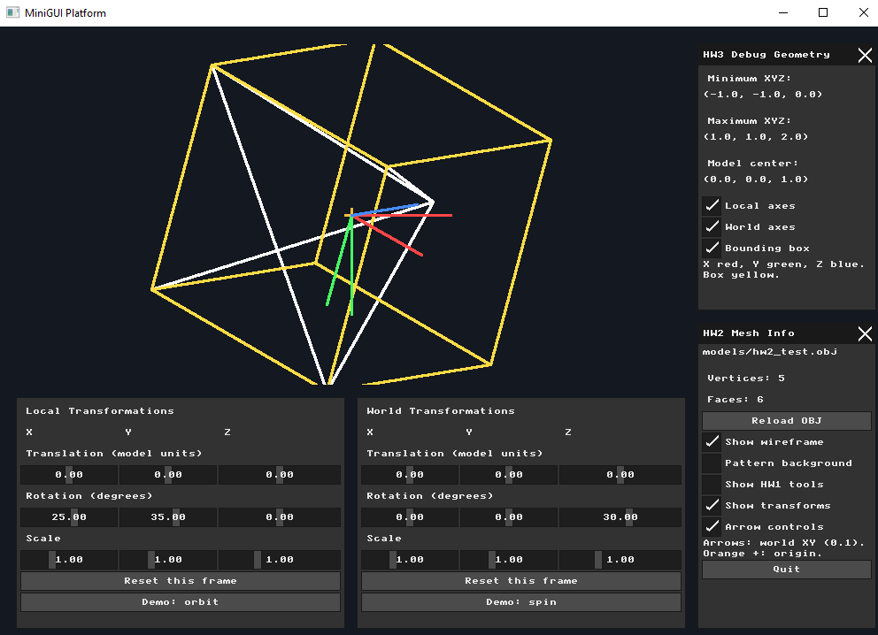
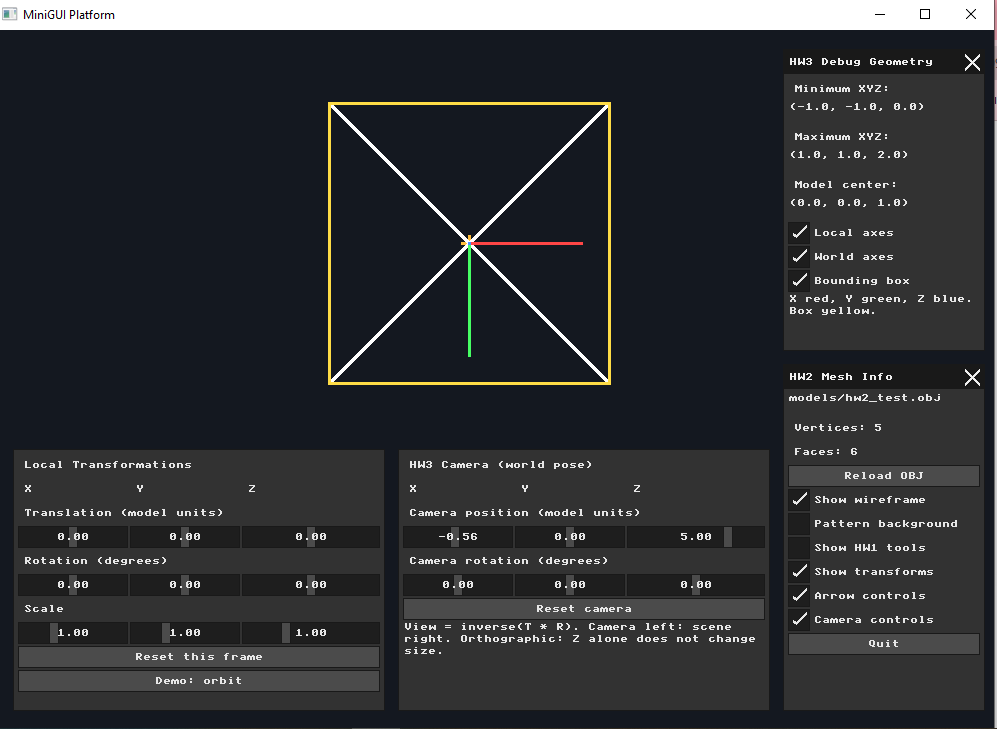
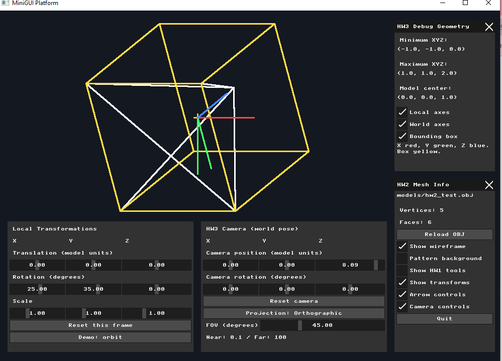
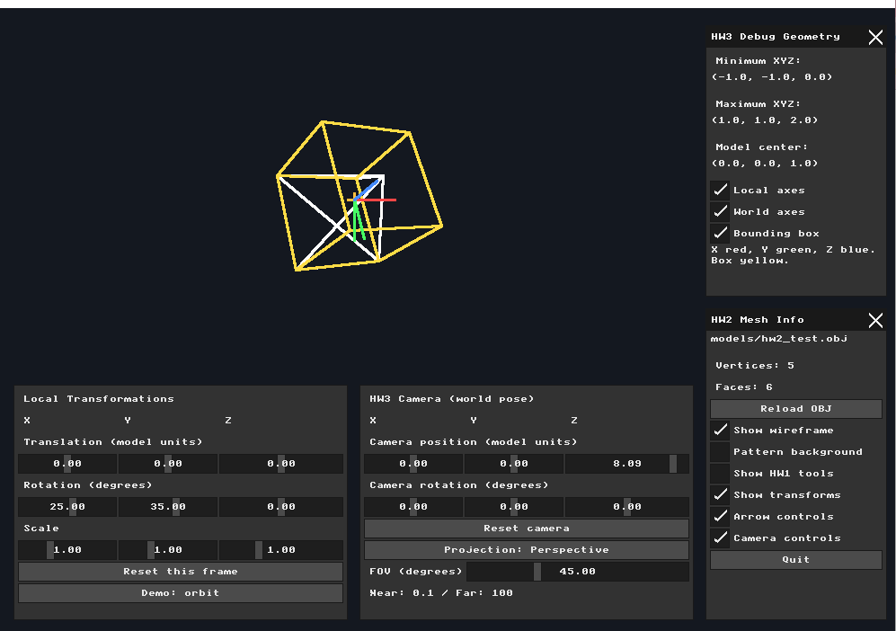
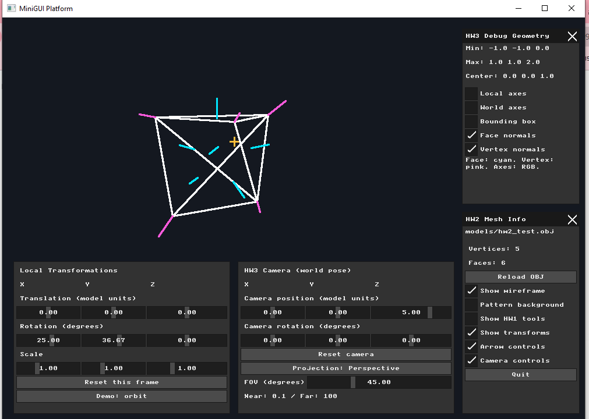

# Assignment 3 — Virtual Cameras and Projections

**Name:** Bayan Hasarme  
**Student ID:** 209432061  
**Submission:** Individual  
**Repository:** [cgatuoh26](https://github.com/bayanhasarme/cgatuoh26)

## Overview

This assignment extends the OBJ wireframe renderer from Assignment 2 with coordinate axes, a bounding box, a virtual camera, perspective projection, and geometric normals. The implementation uses C++ and GLM for mathematics, MiniFB for the framebuffer, MicroUI for controls, and the Bresenham line algorithm from Assignment 1.

The test model is `nanorender/models/hw2_test.obj`, a pyramid with **5 vertices and 6 triangular faces**. Changes were implemented, built, checked interactively, and committed separately for each part.

## Part 1 — Coordinate Frames and Bounding Box

### Implementation

Three independent checkboxes control **Local axes**, **World axes**, and **Bounding box**. The axes are colored red for X, green for Y, and blue for Z. The bounding box is yellow, and the model wireframe is white.

The mesh bounds are:

| Quantity | X | Y | Z |
|---|---:|---:|---:|
| Minimum | -1 | -1 | 0 |
| Maximum | 1 | 1 | 2 |
| Bounding-box center | 0 | 0 | 1 |

Vertices are centered by subtracting the bounding-box center before applying the Model matrix. For column vectors, the transformation order is:

$$
M = M_{world} M_{local}, \qquad M_{frame} = T R S
$$

Local axes start at the centered model origin and use the same Model matrix as the mesh. World axes start at world origin `(0, 0, 0)` and do not receive the model transformations. They still receive the View and Projection transformations when the camera is used.

The eight bounding-box corners are all combinations of minimum and maximum X, Y, and Z. Twelve edges connect corners that differ in exactly one coordinate. Each corner is centered and transformed with the same Model matrix as the mesh.

### Verification

Each checkbox successfully hid and restored its geometry. Local and World rotations were tested: the local axes and box followed the model, while the world axes retained their world orientation.

The screenshot uses Local rotation `(25°, 35°, 0°)` and World rotation `(0°, 0°, 30°)`. Portions of the box extend beyond the scene viewport and are clipped at its boundary.



## Part 2 — Virtual Camera and View Matrix

### Implementation

A `Camera` struct stores a world position and Euler rotation angles. The GUI provides X, Y, and Z sliders for both properties and a **Reset camera** button. The **Camera controls** checkbox switches the lower-right panel between Camera and World controls.

The camera's world pose and the View matrix are:

$$
C = T_{camera} R_{camera}, \qquad V = C^{-1}
$$

Rotation uses the order $R_z R_y R_x$. Inverting the complete camera pose also reverses the transformation order correctly. View is applied after Model and before Projection:

$$
v_{clip} = P V M v_{centered}
$$

### Verification

Camera translation, rotation, and reset were tested interactively. Moving the camera left shifted the scene right. In the screenshot, Camera X is **-0.56**, Y is **0**, Z is **5**, and camera rotation is zero. The model appears to the right of the viewport center.

At this stage, projection remained orthographic, so changing Camera Z alone did not change the model's size.



## Part 3 — Perspective and Orthographic Projections

### Implementation

The camera panel includes a button that switches between **Perspective** and **Orthographic**. Its label identifies the active mode. Perspective uses GLM's `perspectiveRH_NO`; Orthographic uses `orthoRH_NO`.

| Parameter | Value |
|---|---|
| Default vertical FOV | 45° |
| FOV slider range | 20°–100° |
| Scene viewport | 755 × 385 pixels |
| Aspect ratio | 755 / 385 ≈ 1.961 |
| Near plane | 0.1 |
| Far plane | 100 |
| Camera viewing direction | Local negative Z |

After multiplication by Projection and View, homogeneous coordinates are divided by W:

$$
v_{NDC} = \frac{v_{clip}.xyz}{v_{clip}.w}
$$

NDC X and Y are mapped to the scene viewport. Positive screen Y points downward, preserving the convention used in earlier assignments. Orthographic bounds preserve the previous framebuffer scale and remain independent of camera distance.

Segments are clipped against all six homogeneous frustum planes **before** the perspective divide. This handles near-plane crossings and prevents drawing invalid or excessively large projected lines.

### Verification and Comparison

Changing Camera Z from **5** to approximately **8** made the model smaller in Perspective mode. The same change left its size unchanged in Orthographic mode.

The following screenshots use the same model rotation `(25°, 35°, 0°)`, camera position `(0, 0, 8.09)`, and zero camera rotation. FOV is **45°**. The different model sizes and projected geometry demonstrate the two projection modes.

**Orthographic projection**



**Perspective projection**



## Part 4 — Face and Vertex Normals

### Implementation

Normals are computed whenever the OBJ is loaded or reloaded. For each triangle with vertices A, B, and C, the unit face normal and face center are:

$$
n_f = \mathrm{normalize}((B-A) \times (C-A)), \qquad c_f = \frac{A+B+C}{3}
$$

The cross-product direction follows the triangle's vertex order. The test pyramid has consistent outward-facing winding.

Each vertex normal is the normalized sum of the unit normals of its adjacent triangles, giving every triangle equal weight:

$$
n_v = \mathrm{normalize}\left(\sum_{f\,\text{adjacent to}\,v} n_f\right)
$$

Degenerate triangles and zero-length sums are handled without dividing by zero.

Two independent checkboxes control the debug lines:

| Control | Color | Starting point |
|---|---|---|
| Face normals | Cyan | Triangle center |
| Vertex normals | Pink | Mesh vertex |

Normal directions are transformed using the inverse transpose of the Model matrix's linear component:

$$
N = (M_{3\times3}^{-1})^T, \qquad n_{world} = \mathrm{normalize}(N n)
$$

The line's starting point receives the full Model transformation. Its direction receives the normal matrix, so translation does not affect the direction and nonuniform scaling preserves perpendicularity. Endpoints then pass through View, Projection, clipping, and the viewport mapping.

### Verification

The test mesh produces **6 face normals and 5 vertex normals**. Both checkboxes successfully hid and restored their lines. Changing Local rotation moved the normals with the model while keeping their starting points attached to the corresponding faces and vertices.

In the screenshot, the axes and bounding box are hidden to make the normals clear. Local rotation is `(25°, 36.67°, 0°)`, Camera Z is **5**, and Perspective FOV is **45°**.



## Build and Run

From the repository root in Windows PowerShell:

```powershell
cd nanorender
.\build_and_run.ps1
```

Run from `nanorender` so the relative path `models/hw2_test.obj` resolves correctly. If PowerShell blocks the script, allow it for the current session:

```powershell
Set-ExecutionPolicy -Scope Process -ExecutionPolicy Bypass
.\build_and_run.ps1
```

## Submission Scope

Parts **1–4** were completed for this individual submission. Part 5's **LookAt** and **Dolly Zoom** extensions are required for pairs and are outside the scope of this submission. Screenshots are stored in `photos/hw3/`; the implementation is in `nanorender/src/main.cpp`.
