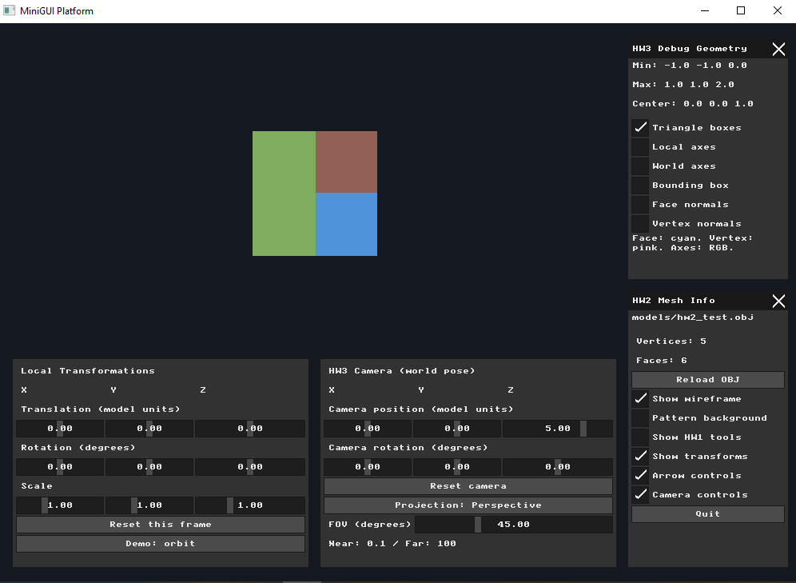
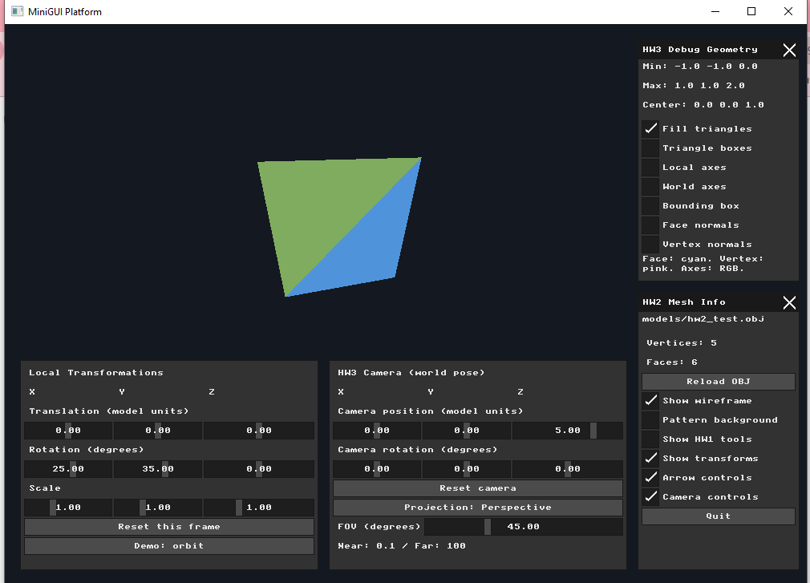
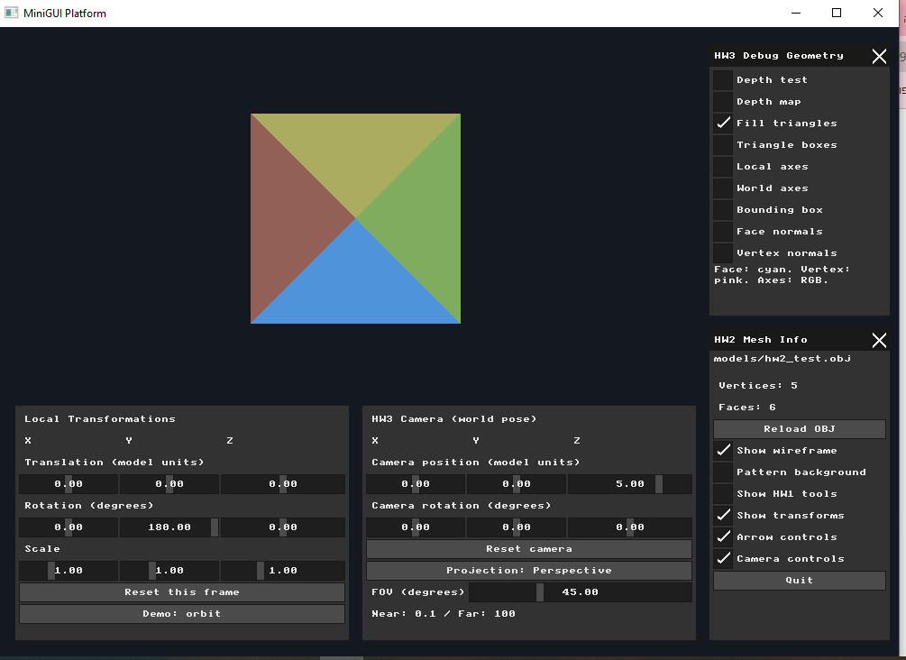
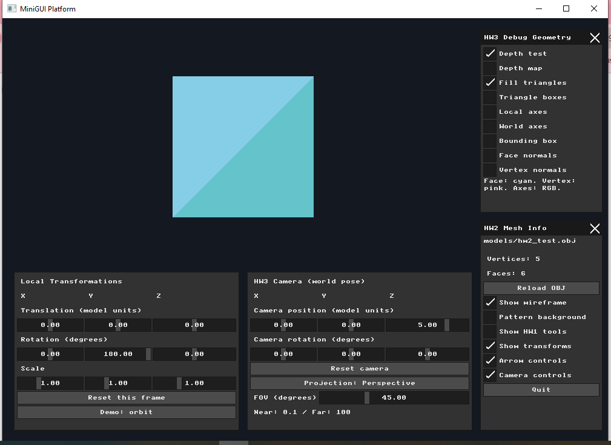
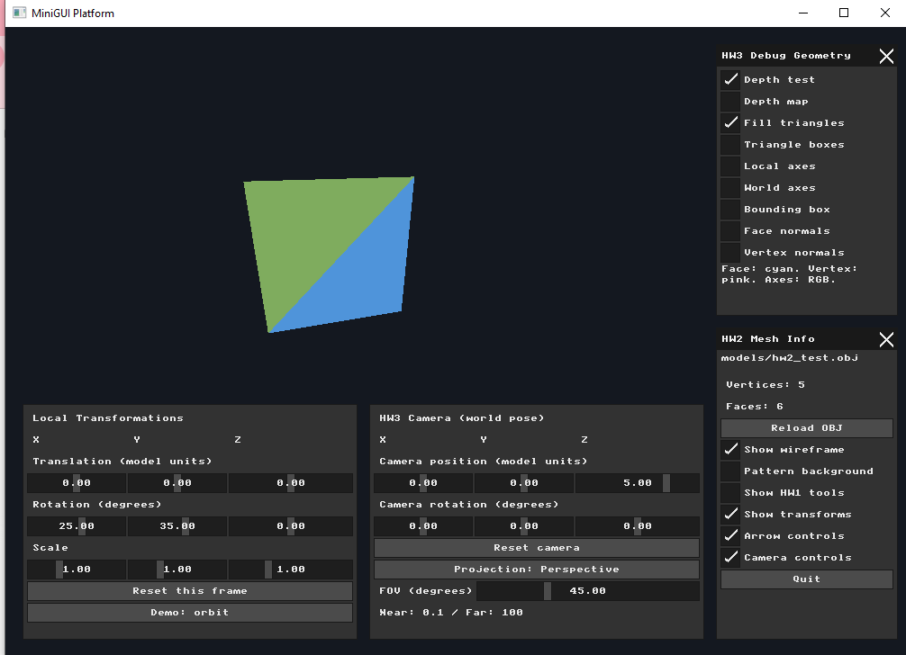
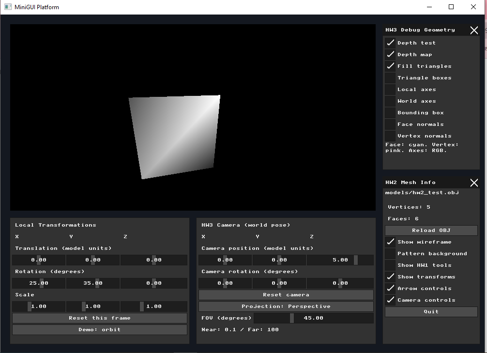

# Assignment 4: Triangle Rasterization and Depth Buffering

**Name:** Bayan Hasarme  
**Student ID:** 209432061  
**Submission:** Individual

## Overview

This assignment extends the software renderer from wireframe rendering to solid triangle rasterization. The implementation progresses through screen-space bounding boxes, barycentric triangle filling, and per-pixel depth testing. A grayscale depth visualization helps inspect the resulting Z-buffer.

The existing model transformations, camera, and projection controls remain available. Parts 1–3 are included in this individual submission; the pair programming extensions are outside its required scope.

## Part 1: Bounding Box Rasterization

For each face, the renderer projects the triangle into screen coordinates and calculates its minimum and maximum X and Y values. It fills the resulting rectangle directly in the color buffer. The rectangle bounds are clamped to the rendering viewport to keep pixel writes within the valid region.

Triangles are clipped against the viewing frustum before the perspective divide. Clipped faces retain their original face color.

Each face receives a random RGB color when the mesh is loaded. These colors remain stable across frames, making overlapping regions easier to compare without flickering. The **Triangle boxes** checkbox enables the bounding-box debug view.

### Result

The model appears as overlapping colored rectangles rather than triangle outlines. The screenshot below shows this debug mode with the geometry helpers hidden.



## Part 2: Barycentric Triangle Filling

The renderer uses each projected triangle's bounding box to limit the pixels it needs to examine. For each candidate pixel, it evaluates the barycentric weights at the pixel center, `(x + 0.5, y + 0.5)`.

For projected vertices A, B, and C and a sample point P, the calculation is:

```text
edge(A, B, P) = (Bx - Ax) * (Py - Ay) - (By - Ay) * (Px - Ax)

area  = edge(A, B, C)
alpha = edge(B, C, P) / area
beta  = edge(C, A, P) / area
gamma = edge(A, B, P) / area
```

A pixel is filled when all three weights lie between 0 and 1. Degenerate triangles with near-zero projected area are skipped. Using the signed area allows the inclusion test to handle either vertex winding.

The **Fill triangles** checkbox enables solid triangle rendering. Each included pixel receives the stable random color assigned to its face.

### Result and visibility limitation

The model now contains filled triangles instead of filled rectangles. Without depth testing, later faces overwrite earlier faces even when they are farther from the camera. Depending on the viewing angle, this can produce incorrect visibility.



## Part 3: Z-Buffer and Depth Visualization

### Depth storage and testing

A floating-point Z-buffer stores one depth value for every pixel in the color buffer. At the beginning of every frame, all entries are reset to positive infinity.

After projection and the perspective divide, each vertex's normalized device coordinate depth is mapped into the range 0–1:

```text
vertex_depth = 0.5 * (clip_z / clip_w) + 0.5
```

The renderer interpolates these projected depth values using the same screen-space barycentric weights used for triangle filling:

```text
pixel_depth = alpha * depth_A + beta * depth_B + gamma * depth_C

if pixel_depth < z_buffer[pixel_index]:
    z_buffer[pixel_index] = pixel_depth
    color_buffer[pixel_index] = face_color
```

A smaller depth represents a closer surface. When depth testing is enabled, a farther fragment is discarded and cannot overwrite a closer one. The **Depth test** checkbox allows comparison with rendering that has no depth test.

### Comparison: depth testing off and on

The model was rotated to a local Y rotation of 180 degrees to expose the visibility problem clearly. With depth testing disabled, farther triangular faces overwrite the nearer base. With depth testing enabled, the nearer base correctly hides those faces.

| Depth testing disabled | Depth testing enabled |
| --- | --- |
|  |  |

### Grayscale depth visualization

The **Depth map** checkbox displays the Z-buffer as grayscale. Pixels without geometry appear black. Among visible surfaces, closer pixels are brighter and farther pixels are darker.

To improve contrast, the visualization finds the minimum and maximum finite depths visible in the current frame and maps that interval to grayscale:

```text
t = (depth - visible_min_depth) / (visible_max_depth - visible_min_depth)
gray = round(40 + 215 * (1 - clamp(t, 0, 1)))
```

A constant-depth surface uses a middle gray value. The depth-map mode always selects the closest fragments so its visualization remains valid even if the separate depth-test checkbox is disabled.

This normalization is relative to the current frame. It helps reveal depth differences within an image, but grayscale intensity should not be interpreted as an absolute distance across different camera views. The grayscale variation represents depth, rather than lighting.

### Color buffer and Z-buffer side by side

These captures use the same model and camera settings so the color rendering can be compared with its depth map.

| Color buffer | Z-buffer visualization |
| --- | --- |
|  |  |

## Verification

The application was built and run on Windows using the project's PowerShell script. The checks performed during development were:

- Enable the bounding-box debug view and confirm that colored rectangles replace the triangle rendering.
- Enable triangle filling and confirm that only pixels inside each triangle are colored.
- Rotate the model to reveal incorrect overlap with depth testing disabled, then enable the depth test and confirm correct occlusion.
- Enable the depth map and confirm that visible surfaces show grayscale depth variation.
- Preserve matching model and camera settings for the color-buffer and Z-buffer screenshots.

Run the application from the `nanorender` directory so the relative model path resolves correctly:

```powershell
cd C:\courses\ComputerGraphics\cgatuoh26-cg-at-uoh-26-cgvibes-uoh-template\nanorender
.\build_and_run.ps1
```

## Files

- Implementation: `nanorender/src/main.cpp`
- Report: `reports/hw4.md`
- Screenshots: `photos/hw4/`

The implementation and screenshots were committed and pushed separately for each assignment part. This report documents the completed individual requirements.
