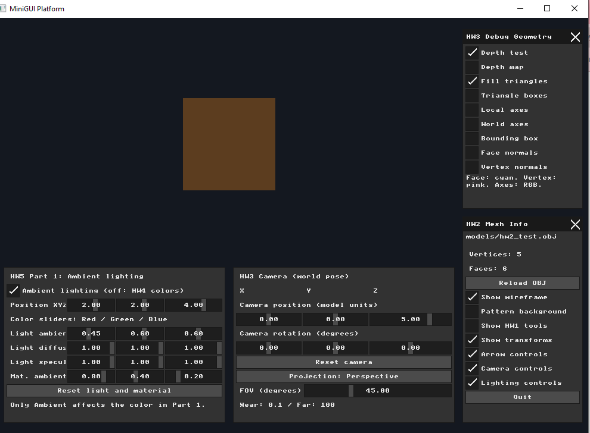
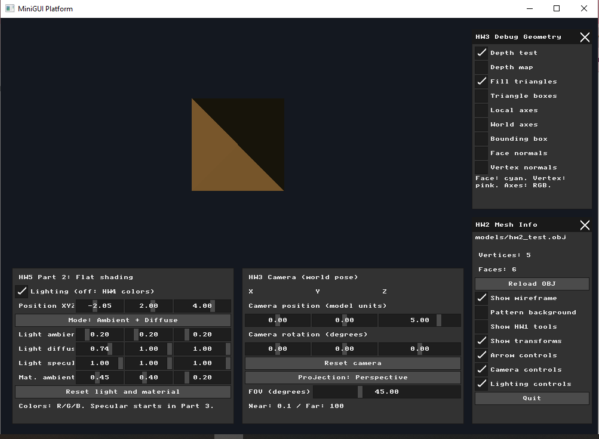
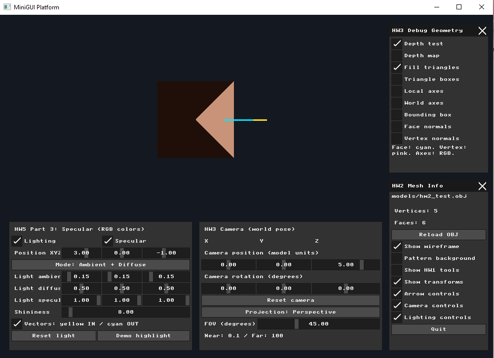
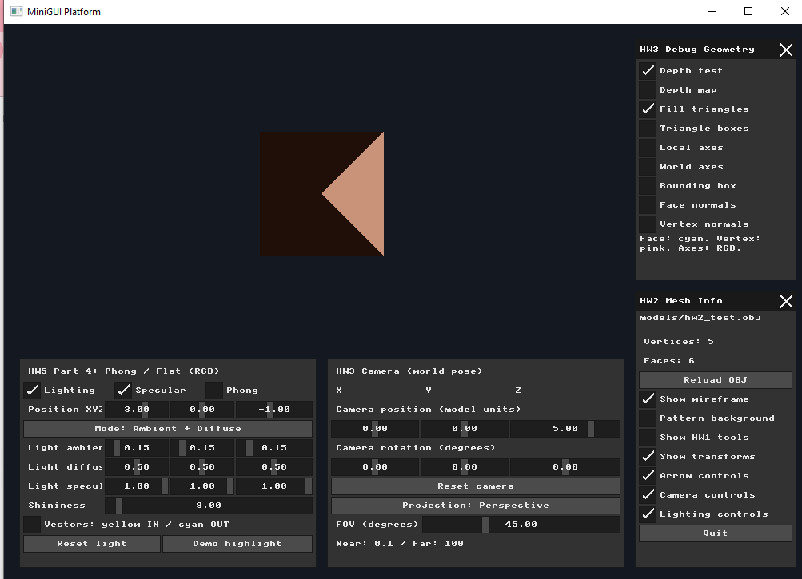
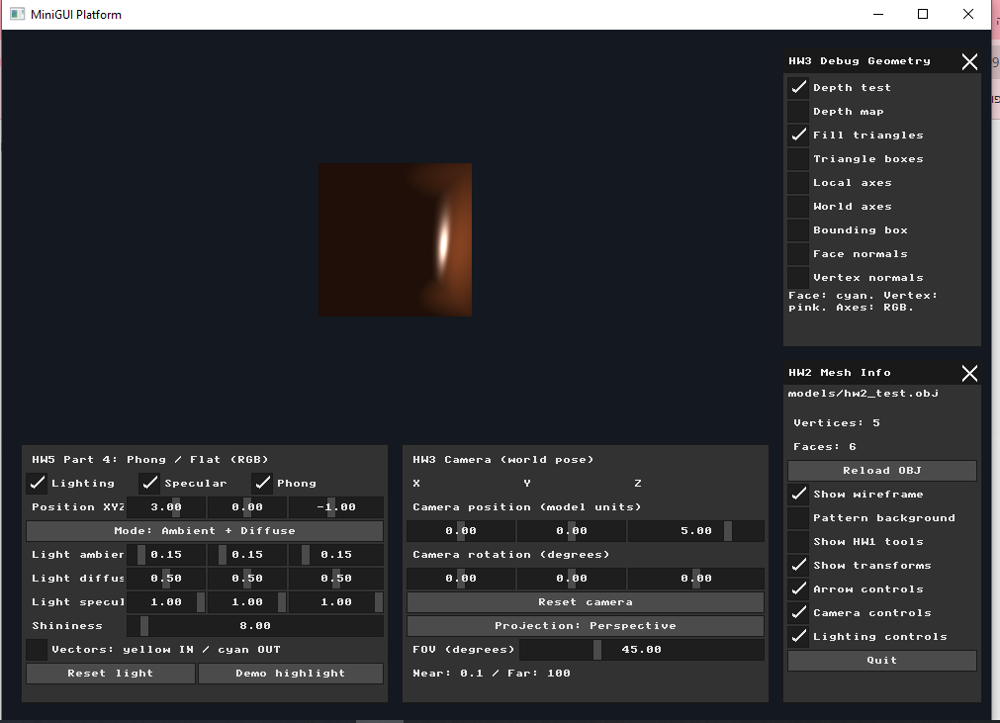

# Assignment 5: Lighting, Materials, and Shading

**Name:** Bayan Hasarme  
**Student ID:** 209432061  
**Submission:** Individual

## Overview

This assignment adds lighting to the software triangle renderer developed in Assignment 4. The implementation progresses from uniform ambient illumination to diffuse flat shading, specular reflection, and per-pixel Phong shading.

The test mesh is the pyramid loaded from `models/hw2_test.obj`, containing five vertices and six triangular faces. The existing camera, model transformations, clipping, barycentric rasterization, and Z-buffer remain part of the rendering pipeline.

This individual submission covers Parts 1–4. The Gouraud shading and texture mapping extensions are required for pair submissions and are outside this submission's scope.

## Part 1: Light Sources and Material Properties

### Data and controls

A `PointLight` structure stores the light's world-space position and separate RGB ambient, diffuse, and specular intensities. A `Material` structure stores the corresponding RGB reflection coefficients and a shininess exponent.

The lighting panel provides sliders for the light's X, Y, and Z position and its three RGB components for each lighting term. Material ambient controls were also provided in Part 1. RGB slider values range from 0 to 1.

### Ambient calculation

Ambient illumination is calculated by component-wise multiplication:

```text
ambient.rgb = light.ambient.rgb * material.ambient.rgb
```

For example, the red output is the light's ambient red intensity multiplied by the material's ambient red coefficient. The same calculation applies independently to green and blue. The resulting RGB values are clamped to 0–1 and converted to framebuffer color channels.

Ambient lighting is independent of the face orientation, light position, and camera position. Consequently, all visible faces have the same color. Changing an ambient color slider changes the model's color, while moving the light alone has no effect in this mode.

### Result



## Part 2: Flat Shading with Diffuse Lighting

Diffuse lighting uses the angle between the surface normal and the direction toward the point light. All lighting positions and directions are expressed in world space.

For each original triangle, the renderer transforms its center and face normal, then evaluates the lighting equation once:

```text
P = transformed face center
N = normalized world-space face normal
L = normalize(light.position - P)

lambert = max(dot(N, L), 0)
diffuse.rgb = light.diffuse.rgb * material.diffuse.rgb * lambert
flat_color.rgb = ambient.rgb + diffuse.rgb
```

Clamping the dot product to zero prevents a light behind a surface from producing a negative diffuse contribution. A surface facing the light receives more diffuse illumination than one facing away.

Normals use the inverse transpose of the model matrix's linear component, followed by normalization:

```text
normal_matrix = transpose(inverse(mat3(model_matrix)))
N = normalize(normal_matrix * object_space_normal)
```

This preserves the correct normal direction under nonuniform scaling. Translation applies to the face center but not to the normal direction.

Every pixel in a triangle receives the same calculated color, producing a faceted appearance. If clipping splits a face into multiple triangles, those pieces retain the original face's flat color.

### Verification and result

The lighting mode button switches between Ambient only and Ambient + Diffuse. Moving the light along X changes which faces receive more light. The apparent movement of the bright triangular region is a change in illumination; the geometry itself remains fixed.



## Part 3: Specular Highlights and Reflection Vectors

### Phong reflection model

Specular lighting compares the outgoing reflection direction with the direction toward the camera. The incoming direction points toward the surface, opposite to L:

```text
I = -L
R = normalize(I - 2 * dot(I, N) * N)
V = normalize(camera.position - P)

specular_factor = pow(max(dot(R, V), 0), material.shininess)
specular.rgb = light.specular.rgb * material.specular.rgb * specular_factor

final_color.rgb = ambient.rgb + diffuse.rgb + specular.rgb
```

The specular term is evaluated only when the face receives diffuse illumination, meaning `dot(N, L) > 0`. This avoids highlights from light arriving behind the surface.

The **Specular** checkbox enables or disables this term. The **Shininess** slider changes the exponent: a higher value concentrates the highlight around directions closely aligned with the reflection vector.

At this stage, the full lighting equation is still evaluated once per face. A highlight therefore changes the entire face's color rather than creating a varying highlight within it.

### Debug vectors

The **Vectors: yellow IN / cyan OUT** checkbox draws short arrows for a few illuminated, camera-facing faces using the existing line-drawing path:

- **Yellow:** incident light direction, traveling from the light side toward the face center.
- **Cyan:** reflected direction, traveling outward from that center.

The arrows use world-space positions and transformed face normals. They are projected with the scene's camera and projection matrices. In the screenshot, their screen projections appear aligned; this does not imply that their three-dimensional directions are identical.

The **Demo highlight** button supplies repeatable model, camera, and light settings for inspecting the specular contribution.



## Part 4: Per-Pixel Phong Shading

### Interpolated position and normal

The **Phong** checkbox selects per-pixel shading. When disabled, the renderer uses the original face center and face normal for flat shading. When enabled, each triangle carries its three world-space vertex positions and transformed vertex normals through the rasterization pipeline.

For a covered pixel, the renderer uses the barycentric weights from the triangle inclusion test to interpolate a position and normal. Under perspective projection, world-space attributes require perspective-correct weights:

```text
qA = alpha / clip_w_A
qB = beta  / clip_w_B
qC = gamma / clip_w_C
sum = qA + qB + qC

weight_A = qA / sum
weight_B = qB / sum
weight_C = qC / sum

P = weight_A * position_A + weight_B * position_B + weight_C * position_C
N = normalize(weight_A * normal_A + weight_B * normal_B + weight_C * normal_C)
```

When W is equal at all vertices, as in orthographic projection, these weights reduce to the ordinary barycentric weights.

The complete Ambient + Diffuse + Specular equation is then evaluated using the interpolated P and normalized N. This allows brightness and highlights to vary within a triangle.

### Clipping and depth integration

Frustum clipping interpolates positions and normal attributes at newly created vertices before the perspective divide. Clipped polygons are triangulated as a fan. The interpolated normal is normalized for each pixel before lighting is evaluated.

Depth testing still occurs before per-pixel lighting. Projected depth uses the ordinary screen-space barycentric interpolation of normalized device coordinate depth, while world-space lighting attributes use the perspective-correct weights above.

### Flat versus Phong comparison

The following screenshots use matching light, camera, and model settings:

- Light position: `(3, 0, -1)`
- Light ambient RGB: `(0.15, 0.15, 0.15)`
- Light diffuse RGB: `(0.5, 0.5, 0.5)`
- Light specular RGB: `(1, 1, 1)`
- Shininess: `8`
- Camera position: `(0, 0, 5)`, with zero rotation
- Perspective FOV: `45` degrees

Only the Phong checkbox changes between the captures.

| Flat shading — Phong disabled | Phong shading — enabled |
| --- | --- |
|  |  |

Flat shading produces a constant color on each face. Phong shading produces continuous brightness variation and a localized highlight within the visible surface.

Interpolating vertex normals changes the apparent smoothness of the lighting, not the mesh geometry. The pyramid's silhouette remains unchanged. Averaging normals across this deliberately small, sharp-edged mesh gives it a rounded lighting appearance; preserving sharp material edges would require separate normals at those edges.

## Interactive Controls

| Control | Purpose |
| --- | --- |
| Lighting | Enable material lighting; when disabled, use Assignment 4 face colors. |
| Position XYZ | Move the point light in world space. |
| Ambient / Diffuse mode button | Select ambient-only lighting or include diffuse and the enabled specular term. |
| Light ambient, diffuse, specular | Adjust each light term's RGB intensity. |
| Specular | Enable or disable reflection highlights. |
| Shininess | Adjust the specular exponent. |
| Phong | Switch between per-face Flat and per-pixel Phong shading. |
| Vectors | Show incident and reflected direction arrows. |
| Reset light | Restore the default light and material. |
| Demo highlight | Apply repeatable settings for observing highlights. |
| Lighting controls | Switch the lower-left panel between lighting and local transformation controls. |

## Validation and Running

The application was built and run on Windows using `build_and_run.ps1`. Screenshots document ambient lighting, diffuse flat shading, reflection-vector visualization, and a comparison of Flat and Phong modes. Interactive checks included changing ambient RGB values, moving the light, and switching shading modes.

Run from `nanorender` so the relative model path resolves correctly:

```powershell
cd C:\courses\ComputerGraphics\cgatuoh26-cg-at-uoh-26-cgvibes-uoh-template\nanorender
.\build_and_run.ps1
```

## Submission Files

- Implementation: `nanorender/src/main.cpp`
- Test model: `nanorender/models/hw2_test.obj`
- Report: `reports/hw5.md`
- Screenshots: `photos/hw5/`

The assignment was developed in separate parts, with a dedicated commit for each implementation stage. This report documents the four required parts of the individual submission.
