# Terrain Lab — Final Project Report

**Name:** Bayan Hasarme  
**Student ID:** 209432061  
**Submission:** Individual

## 1. Project Overview

Terrain Lab is an interactive procedural terrain application developed for the Computer Graphics course.

The project combines procedural mesh generation with a CPU software rendering pipeline. Terrain heights are generated mathematically rather than loaded from a terrain model. The resulting mesh is projected, rasterized, shaded and displayed in a MiniFB window.

Users can change the terrain generation parameters, rotate the camera, adjust zoom and control the water level. Current settings and keyboard instructions are displayed inside the application.

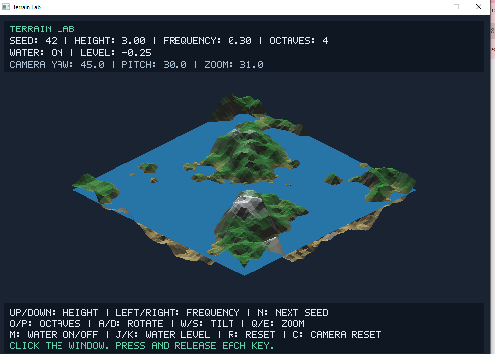

## 2. Project Objectives

The main objectives were:

- Generate a reproducible terrain from a numerical seed.
- Combine multiple noise layers to produce terrain at different scales.
- Implement an interactive orthographic camera.
- Fill triangles using a software rasterizer.
- Resolve visibility using a depth buffer.
- Calculate surface normals and apply directional lighting.
- Assign terrain colors using height and slope.
- Render an adjustable water surface.
- Document development through small Git commits and screenshots.

The project brings together mesh modeling, transformations, rasterization, hidden-surface removal, shading and procedural modeling.

## 3. Implementation Environment

The application is written in C++23.

Development and manual validation were performed on Windows using Visual Studio C++ Build Tools, CMake, Ninja, PowerShell and VS Code.

MiniFB is used to create the window, display the pixel buffer and read keyboard input. Terrain generation, camera calculations, triangle rasterization, depth testing, lighting and bitmap text rendering are implemented in the project.

The project does not use OpenGL for rendering.

### Main files

| File | Responsibility |
| --- | --- |
| `src/main.cpp` | Mesh generation, noise, camera, rasterizer, lighting, terrain colors, water and keyboard input |
| `src/hud.h` | Bitmap characters, information panels and keyboard help |
| `CMakeLists.txt` | Build configuration and MiniFB dependency |
| `build_and_run.ps1` | Windows configuration, compilation and execution |
| `screenshots/` | Visual development milestones |
| `README.md` | Features, controls and build instructions |
| `PROGRESS.md` | Earlier development notes |
| `REPORT.md` | Final technical report |

## 4. Terrain Mesh

The terrain begins as a regular grid on the XZ plane.

For a grid with \(C\) cells along each axis, the number of vertices is:

\[
V=(C+1)^2
\]

Each square contains two triangles, so the number of triangles is:

\[
T=2C^2
\]

The final grid uses 64 cells per axis and a spacing of 0.25 world units:

\[
V=65^2=4225
\]

\[
T=2\cdot64^2=8192
\]

The terrain covers 16 by 16 world units, centered at the origin. Its X and Z coordinates range from -8 to 8.

The vertex heights are changed during terrain generation, while the triangle connectivity remains fixed.

Triangle winding is chosen so that a flat grid has upward-facing normals.

### Initial flat grid

The first mesh milestone used a smaller grid and a wireframe renderer to inspect its topology.

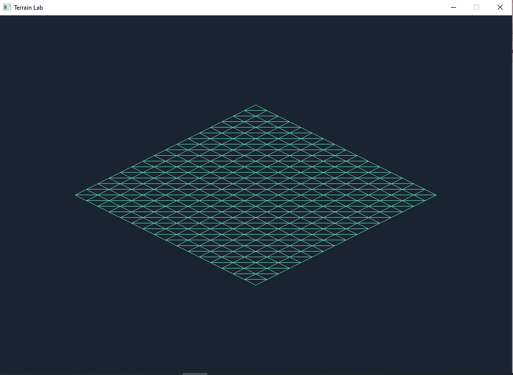

## 5. Development of the Height Function

### 5.1 Gaussian Hill

Before introducing noise, a Gaussian hill was used to verify that vertex height changes were correctly reflected in the rendered mesh.

The height function was:

\[
h(x,z)=H\exp\left(-\frac{x^2+z^2}{2r^2}\right)
\]

Here, \(H\) controls the peak height and \(r\) controls the hill width.

This stage provided a simple, predictable surface for checking the transition from a flat grid to a three-dimensional terrain.

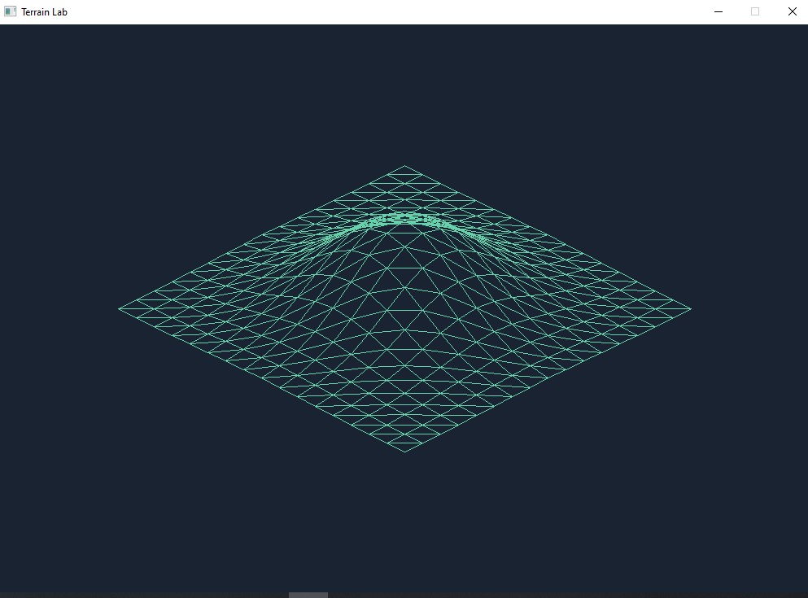

The final application uses fractal noise. The Gaussian hill function remains in the source as an earlier generation method.

### 5.2 Seeded Value Noise

Value noise assigns pseudorandom values to integer lattice coordinates.

The implementation hashes the integer X and Z coordinates together with a seed. The hash is converted to a value in the range [-1, 1].

For a point between lattice coordinates, the surrounding four values are interpolated.

The interpolation parameter is smoothed using:

\[
s(t)=t^2(3-2t)
\]

This reduces abrupt changes at lattice boundaries.

The seed makes generation deterministic: the same seed and settings produce the same terrain.

The implementation uses value noise, rather than gradient-based Perlin noise.

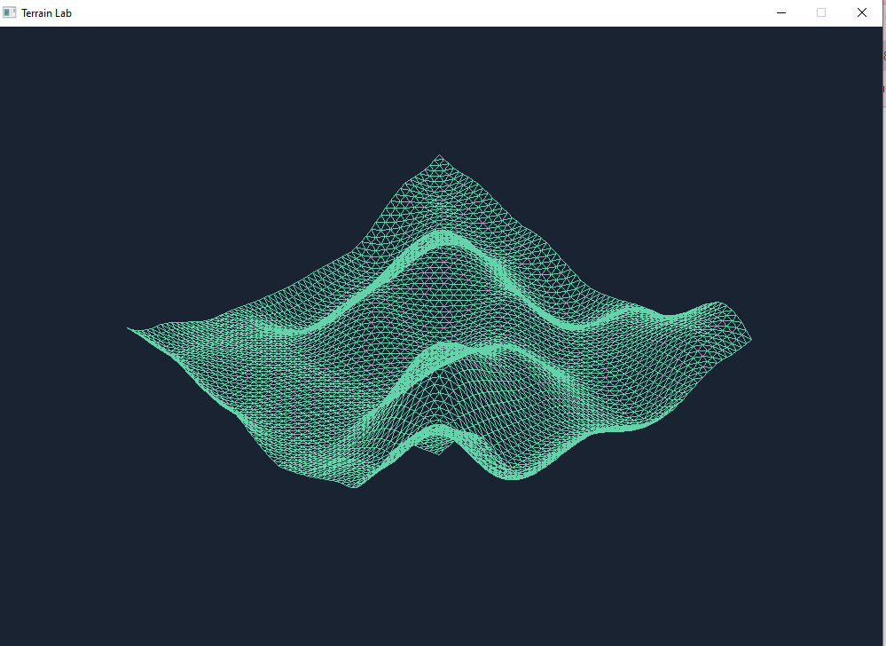

### 5.3 Multi-Octave Fractal Noise

Several value-noise layers are combined to produce terrain details at different scales.

Each successive layer:

- Increases frequency by the lacunarity factor.
- Decreases its contribution by the persistence factor.

The normalized height function is:

\[
h(x,z)=
A\frac{
\sum_{i=0}^{O-1}p^i
N(f\ell^i x,f\ell^i z,\mathrm{seed})
}{
\sum_{i=0}^{O-1}p^i
}
\]

Where:

| Symbol | Meaning | Default |
| --- | --- | --- |
| \(A\) | Height amplitude | 3.0 |
| \(f\) | Base frequency | 0.3 |
| \(O\) | Octave count | 4 |
| \(p\) | Persistence | 0.5 |
| \(\ell\) | Lacunarity | 2.0 |

Normalization keeps the overall height scale controlled when the octave count changes.

The implementation reuses the same seed for every octave and samples the noise at increasing spatial frequencies.

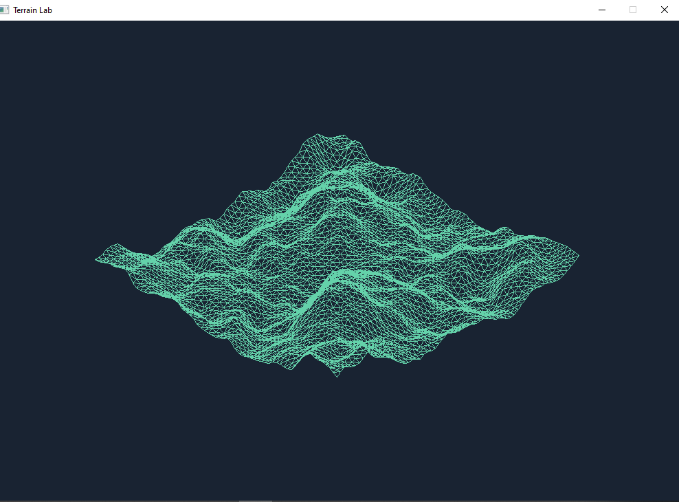

## 6. Interactive Terrain Parameters

Terrain generation settings can be changed during execution.

| Parameter | Supported range or behavior |
| --- | --- |
| Height amplitude | 0.0 to 6.0, in steps of 0.5 |
| Base frequency | 0.05 to 0.5, in steps of 0.05 |
| Octave count | 1 to 4 |
| Seed | Incremented by pressing N |

The controls use press detection: a key triggers one adjustment when it changes from released to pressed.

When a terrain parameter changes, vertex heights are regenerated and the scene is redrawn.

Camera and water changes redraw the scene without regenerating the terrain heights.

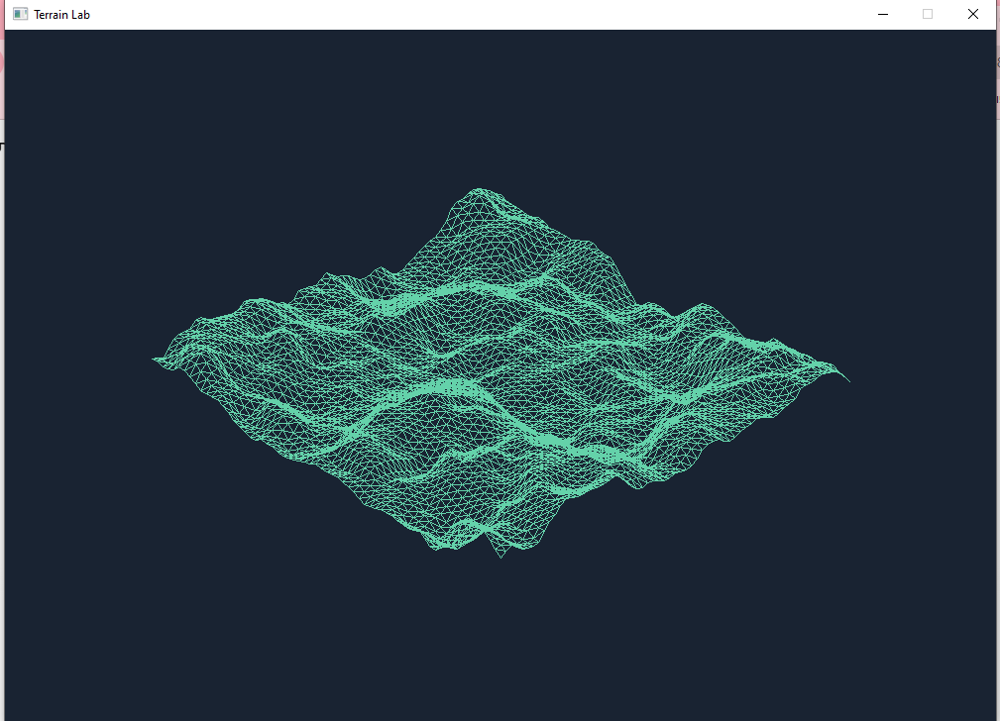

## 7. Orthographic Camera

The camera supports horizontal rotation, vertical tilt and zoom.

Let the yaw angle be \(\theta\), the pitch angle be \(\phi\), and a vertex be \((x,y,z)\).

Horizontal rotation produces:

\[
u=\cos\theta\,x-\sin\theta\,z
\]

\[
q=\sin\theta\,x+\cos\theta\,z
\]

The vertical screen coordinate before scaling is:

\[
v=\sin\phi\,q-\cos\phi\,y
\]

The depth coordinate is:

\[
d=\cos\phi\,q+\sin\phi\,y
\]

The screen coordinates are:

\[
x_s=\frac{W}{2}+ku
\]

\[
y_s=\frac{H}{2}+kv
\]

Here, \(W\) and \(H\) are the framebuffer dimensions and \(k\) is the camera scale.

This is an orthographic projection: object size does not decrease with distance.

In this depth convention, larger depth values represent points closer to the viewing side of the camera.

Camera pitch and zoom are bounded, and yaw is wrapped to prevent indefinite angle growth.

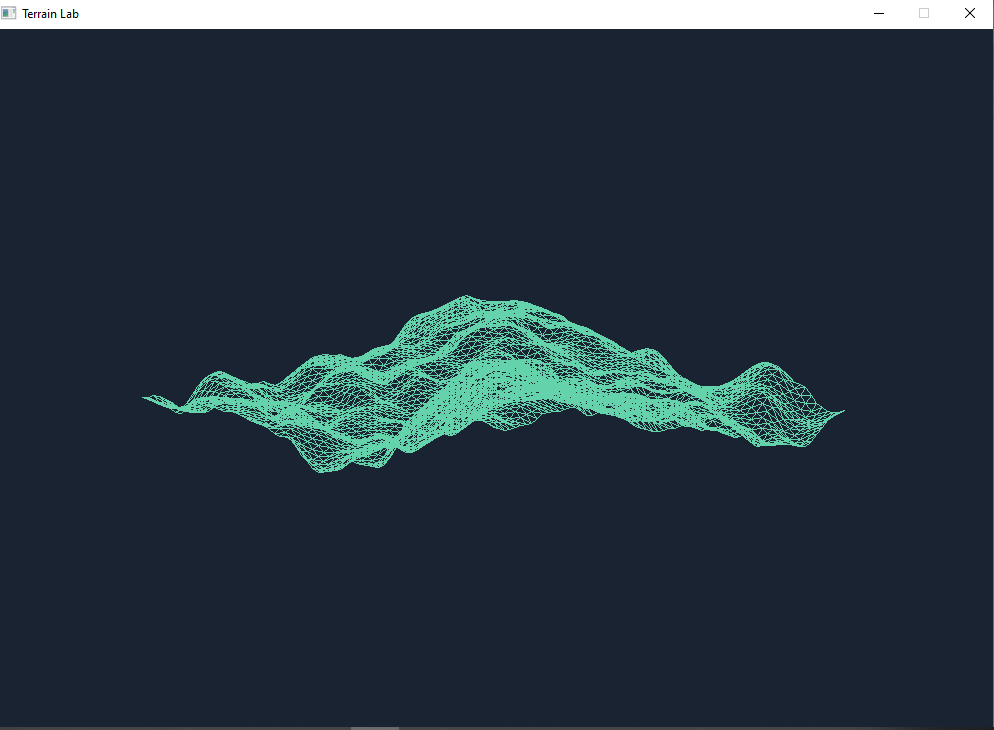

## 8. Triangle Rasterization

Each projected triangle is processed using a bounding-box rasterizer.

The procedure is:

1. Calculate the triangle's screen-space bounding box.
2. Restrict the box to the framebuffer boundaries.
3. Sample the center of each candidate pixel.
4. Calculate barycentric coordinates.
5. Reject pixels outside the triangle.
6. Interpolate depth and perform the depth test.
7. Write the triangle color for visible pixels.

The edge function is:

\[
E(a,b,p)=
(b_x-a_x)(p_y-a_y)
-
(b_y-a_y)(p_x-a_x)
\]

The triangle's signed area is:

\[
D=E(a,b,c)
\]

Barycentric coordinates are:

\[
w_a=\frac{E(b,c,p)}{D}
\]

\[
w_b=\frac{E(c,a,p)}{D}
\]

\[
w_c=\frac{E(a,b,p)}{D}
\]

Pixels are accepted when all three weights are nonnegative. Dividing by the signed area allows the test to handle both winding directions.

Triangles with a near-zero projected area are skipped.

## 9. Hidden-Surface Removal

A depth buffer stores one depth value per framebuffer pixel.

At the beginning of each redraw, the buffer is cleared to negative infinity.

Depth is interpolated using the barycentric weights:

\[
d_p=w_a d_a+w_b d_b+w_c d_c
\]

A fragment is written only when:

\[
d_p>d_{\mathrm{stored}}
\]

The stored color and depth are then updated.

Since the projection is orthographic, linear screen-space interpolation is appropriate for these depth values.

This allows foreground surfaces to hide background surfaces. For fragments with different depths, visibility is determined by the depth comparison rather than triangle submission order.

Temporary variations in triangle color were used during the initial filled-rendering stage to make triangle boundaries easier to inspect.

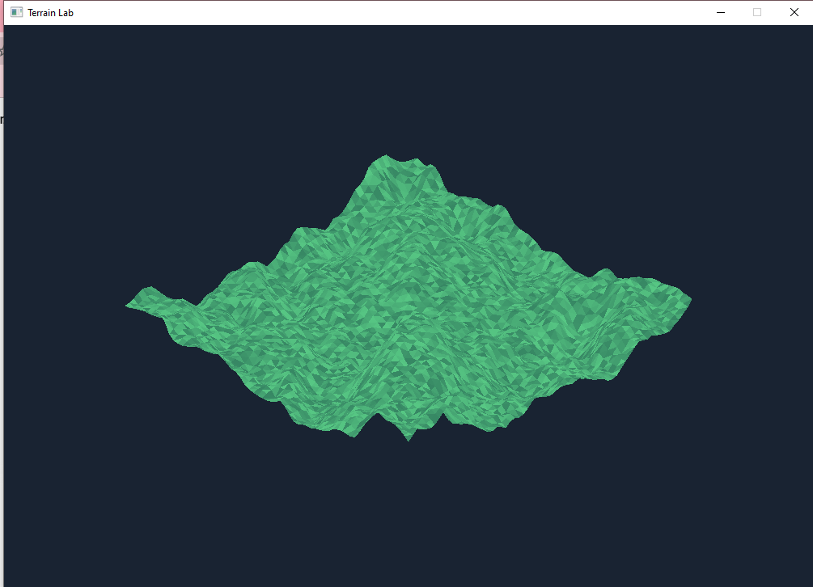

## 10. Normals and Lighting

### 10.1 Face Normals

For triangle vertices \(a\), \(b\) and \(c\), the face normal is:

\[
n=
\frac{(b-a)\times(c-a)}
{\|(b-a)\times(c-a)\|}
\]

Normals are calculated from world-space vertices.

Each triangle uses one normal, producing flat shading. Individual facets remain visible, especially on rough terrain.

### 10.2 Lambert Diffuse Lighting

The fixed direction toward the light is:

\[
L=\operatorname{normalize}(-0.6,1.0,-0.4)
\]

The diffuse contribution is:

\[
I_d=\max(0,n\cdot L)
\]

Brightness includes an ambient contribution:

\[
I=0.25+0.75I_d
\]

The base color is multiplied by this brightness.

The ambient term keeps surfaces facing away from the light visible.

The light remains fixed in world space when the camera rotates. Lighting is calculated from surface orientation, without cast shadows or specular highlights.

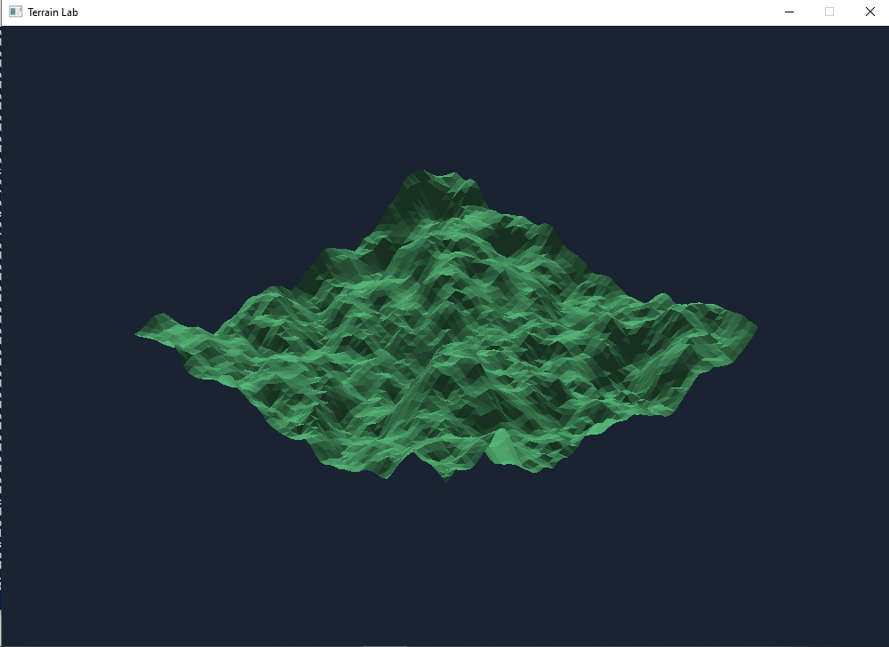

## 11. Terrain Colors

The base color is selected using the average height of each triangle and its slope.

Average height is:

\[
\bar h=\frac{y_a+y_b+y_c}{3}
\]

Slope is estimated from the upward component of the normal:

\[
s=1-\operatorname{clamp}(n_y,0,1)
\]

A horizontal upward-facing surface has a slope value of zero. Steeper surfaces have larger values.

The color rules are:

| Material appearance | Rule |
| --- | --- |
| Sand | Favored at low heights |
| Grass | Blended in as height increases |
| Rock | Blended in on steep slopes |
| Snow | Favored at high elevations on relatively gentle slopes |

Transitions use clamped smoothstep interpolation.

The color is assigned per triangle and then modified by lighting. These are procedural color rules; no image texture is loaded.

The height thresholds are fixed in world units. Changing terrain amplitude can therefore change both the terrain shape and the amount of visible snow.

The sand thresholds are also fixed and do not move when the water level changes.

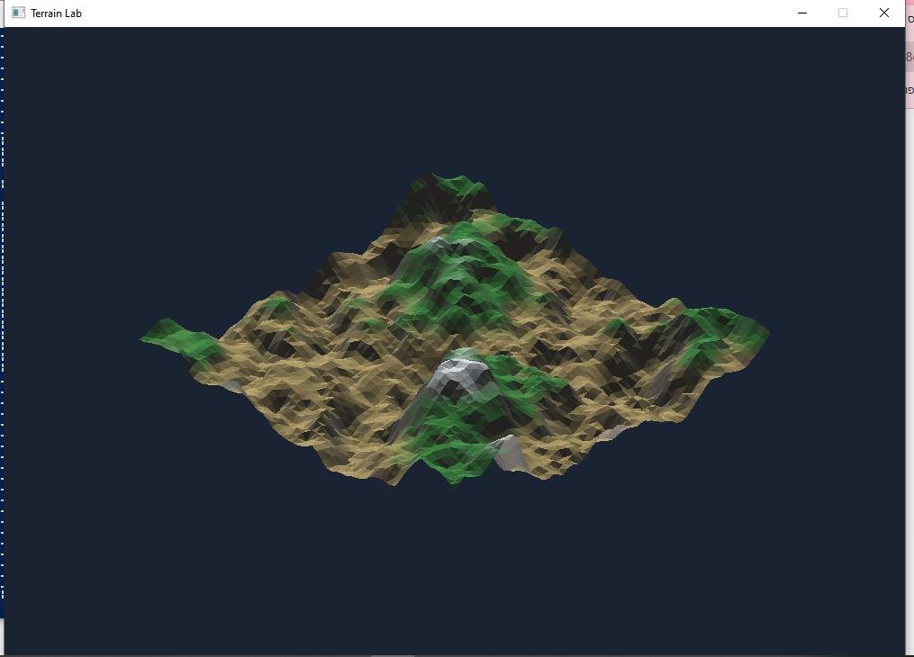

## 12. Water Surface

Water is represented by a horizontal square covering the same XZ extent as the terrain.

The square consists of two triangles. Its height is controlled by the water-level setting.

Water is drawn using the same projection, rasterizer and depth buffer as the terrain.

Consequently:

- Terrain above the water can remain visible.
- Water can hide terrain below its surface.
- Foreground terrain can hide water behind it.

The default water level is -0.25. It can be adjusted between -3.0 and 3.0 in steps of 0.25, or hidden entirely.

The water is opaque and flat. It does not simulate waves, transparency, reflections or water volume.

Its square outer boundary corresponds to the finite terrain domain.

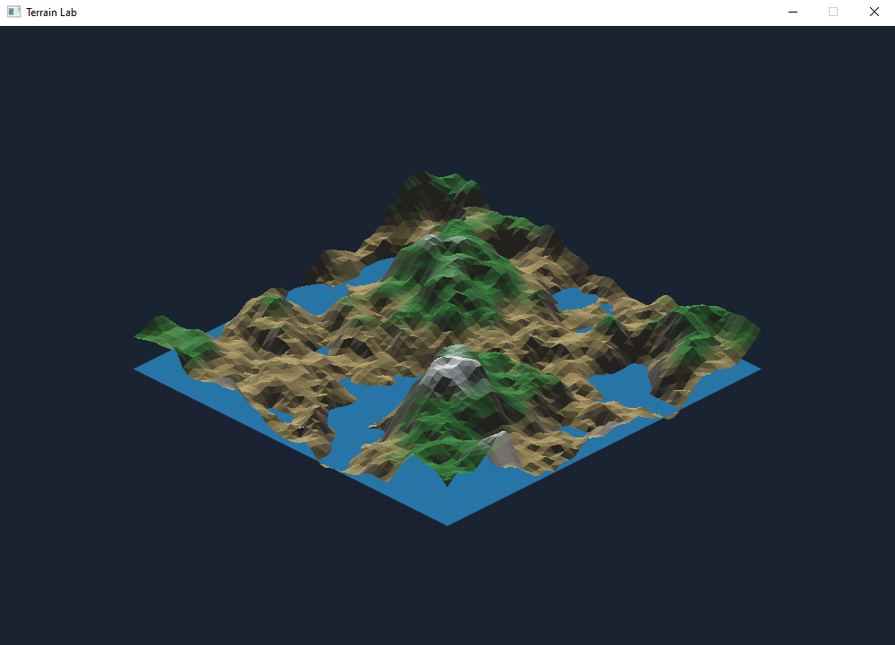

## 13. On-Screen Information

The application displays:

- Seed.
- Height amplitude.
- Noise frequency.
- Octave count.
- Water visibility and level.
- Camera yaw, pitch and zoom.
- Keyboard instructions.

Text is rendered with a small 5 by 7 bitmap character set implemented in `src/hud.h`.

The information panels are drawn after the three-dimensional scene. They intentionally appear over the scene and do not participate in depth testing.

This interface allows users to inspect current parameters without switching to the terminal.


## 14. Keyboard Controls

Click the application window before using the controls. Press and release each key for each adjustment.

| Keys | Action |
| --- | --- |
| Up / Down | Increase / decrease terrain height |
| Right / Left | Increase / decrease noise frequency |
| N | Next terrain seed |
| O / P | Increase / decrease octave count |
| A / D | Rotate camera |
| W / S | Adjust camera tilt |
| Q / E | Zoom out / in |
| M | Show / hide water |
| J / K | Lower / raise water level |
| R | Reset terrain and water |
| C | Reset camera |

## 15. Manual Validation

Validation was performed incrementally through compilation, interactive checks and screenshots.

These are manual checks rather than an automated test suite.

| Check | Expected behavior | Recorded outcome |
| --- | --- | --- |
| Build and launch | Application compiles and opens | Passed during development |
| Seed change | A new seed changes the terrain | Passed |
| Seed reset | R restores seed 42 and the original terrain | Passed by visual comparison |
| Height control | Increasing amplitude increases terrain height variation | Passed |
| Frequency control | Changing frequency changes the terrain pattern | Passed |
| Camera controls | Rotation, tilt and zoom change the view | Passed |
| Flat lighting | Zero amplitude produces a uniformly lit flat terrain | Passed |
| Water visibility | M hides and restores the water | Passed |
| Water increase | K raises the level and covers more low terrain | Passed |
| Water decrease | J lowers the level and reveals terrain | Passed |
| Water display | Displayed level changes with water controls | Passed |
| Information panels | Values and keyboard help are readable | Passed |

A final reset check changed the seed from 42 to 44 and then restored it to 42. The terrain returned to its original appearance.

A water-level check raised the displayed level from -0.25 to 0.00 and lowered it back. The visible water coverage changed accordingly.

Screenshots document representative states. They do not replace exhaustive numerical testing of the renderer.

## 16. Incremental Development

Development was divided into small implementation and documentation tasks.

The main milestones were:

1. Project plan and build setup.
2. Flat grid generation and wireframe rendering.
3. Gaussian hill generation.
4. Seeded value noise.
5. Multi-octave fractal noise.
6. Keyboard terrain controls.
7. Camera rotation and zoom.
8. Filled triangles and depth testing.
9. Face normals and lighting.
10. Height and slope colors.
11. Adjustable water surface.
12. On-screen settings and keyboard help.
13. Documentation and final validation.

Each milestone was recorded through separate Git commits. Visual milestones were also documented with screenshots.

## 17. Implementation Decisions

### Reproducible generation

Seeded hashing allows a terrain to be regenerated without storing every height value.

### Fixed grid connectivity

Only vertex heights change when terrain parameters change. Triangle indices can be reused.

### Software rasterization

Implementing pixel coverage and depth comparisons explicitly demonstrates how a rendering pipeline works.

### Flat shading

One normal per triangle provides a straightforward lighting implementation and makes surface orientation visible.

### Shared depth buffer

Terrain and water use the same visibility mechanism, avoiding a separate screen-space water mask.

### Separate interface header

Bitmap text and information-panel rendering are separated from terrain rendering in `src/hud.h`.

### Redraw on changes

The scene is rasterized when settings change. The framebuffer is reused between changes.

## 18. Current Limitations

- The camera supports orthographic projection only.
- Shading uses face normals rather than interpolated vertex normals.
- Lighting uses one fixed directional light.
- Cast shadows and specular highlights are not implemented.
- Water is a flat opaque plane.
- The terrain is a finite height field with open boundaries.
- No terrain export or saved parameter presets are implemented.
- Input uses individual key presses.
- Large zoom values can place terrain outside the window or behind the information panels.
- The rasterizer uses floating-point coverage tests without multisample antialiasing or a formal top-left edge rule.
- Performance has not been systematically benchmarked.
- Validation is manual and does not constitute an exhaustive correctness test.

## 19. Possible Future Extensions

Possible extensions include:

- Smooth shading with vertex normals.
- Perspective projection.
- Adjustable light direction.
- Water reflections or animated waves.
- Mouse controls and parameter sliders.
- Terrain export to OBJ.
- Saved terrain presets.
- Automated checks for noise reproducibility and rasterizer depth behavior.

These extensions are not part of the current implementation.

## 20. Build and Demonstration

Open PowerShell in the `terrain-lab` folder:

```powershell
.\build_and_run.ps1
```

The first configuration requires an internet connection to fetch MiniFB.

A short demonstration can follow this sequence:

1. Show the default terrain and on-screen settings.
2. Press N to generate another terrain.
3. Change height amplitude with Up / Down.
4. Rotate and tilt the camera with A / D and W / S.
5. Toggle water with M.
6. Raise and lower water with K / J.
7. Press R and C to restore the initial settings.

## 21. Conclusion

Terrain Lab integrates procedural terrain generation with a working software rendering pipeline.

The application demonstrates grid meshes, deterministic fractal value noise, orthographic camera transformations, barycentric triangle rasterization, depth testing, face-normal lighting, procedural terrain colors and an adjustable water plane.

Incremental implementation, manual checks and screenshots document the development from a flat wireframe grid to an interactive shaded terrain application.